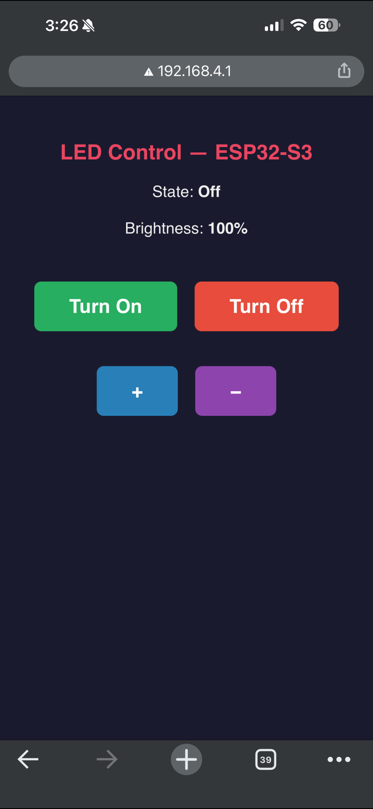

# Project 6 — LED Control over Wi-Fi (ESP32-S3)

ESP32-S3 runs as a Wi-Fi Access Point, hosts an HTTP server, and serves a web page
for remote LED control. Brightness is regulated via PWM. The built-in BOOT button
provides physical control directly from the board.

## Wiring

```
 ┌─────────────────────────────────────────────────┐
 │              ESP32-S3 DevKit-C1                  │
 │                                                  │
 │  3V3 ○                                ○ GND      │
 │  EN  ○                                ○ IO43     │
 │  IO4 ○                                ○ IO44     │
 │  IO5 ○                                ○ IO1      │
 │  IO6 ○                                ○ IO2      │
 │  IO7 ○                                ○ IO42     │
 │  IO15○                                ○ IO41     │
 │  IO16○                                ○ IO40     │
 │  IO17○                                ○ IO39     │
 │  IO18○                                ○ IO38     │
 │  IO8 ○                                ○ IO37     │
 │  IO3 ○                                ○ IO36     │
 │  IO46○                                ○ IO35     │
 │  IO9 ○                                ○ IO0      │  ← BOOT button
 │  IO10○                                ○ IO45     │
 │  IO11○                                ○ IO48     │
 │  IO12○                                ○ IO47     │
 │  IO13○                                ○ IO21     │
 │  IO14○                                ○ IO20     │
 │  5V  ○                                ○ IO19     │
 │  GND ○─────────────────────────────────────────┐ │
 └───┬─────────────────────────────────────────────┘ │
     │ IO16 (PWM)                                     │
     ▼                                                │
  GPIO16 ──── [220 Ω] ──── A ──►── K ──── GND
              resistor     LED anode  LED cathode
```

| Pin     | Component            | Purpose                    |
|---------|----------------------|----------------------------|
| GPIO 16 | 220 Ω → LED anode    | PWM output (LEDC channel 0)|
| GPIO 0  | Built-in BOOT button | Physical brightness control|
| GND     | LED cathode          | Common ground              |

> 220 Ω resistor limits current: (3.3 V − 2 V) / 220 Ω ≈ 6 mA.
> The BOOT button is already on the board, pulled up to 3.3 V — no external components needed.

## How PWM Controls Brightness

LEDC (LED Control) is a hardware PWM peripheral on the ESP32-S3. It generates a
5 kHz signal on GPIO 16. Brightness is determined by the **duty cycle** — the fraction
of time the pin is HIGH within each period.

```
  brightness = 255 (100%)    Full brightness
  ┌───────────────────────┐
  │                       │
──┘                       └──

  brightness = 128 (50%)     Half brightness
  ┌──────┐       ┌──────┐
  │      │       │      │
──┘      └───────┘      └──

  brightness = 64 (25%)      Quarter brightness
  ┌───┐          ┌───┐
  │   │          │   │
──┘   └──────────┘   └──────

  brightness = 0 (0%)        LED off
────────────────────────────
```

At 5 kHz the flicker is invisible — the eye perceives only average brightness.

## Web UI



## Wi-Fi Settings

| Parameter | Value               |
|-----------|---------------------|
| SSID      | `ESP32_LED_Control` |
| Password  | `password123`       |
| IP        | `192.168.4.1`       |
| Port      | `80`                |

## HTTP Routes

| URL         | Action                        |
|-------------|-------------------------------|
| `/`         | Main page                     |
| `/on`       | Turn LED on                   |
| `/off`      | Turn LED off                  |
| `/brighter` | Increase brightness by ~10%   |
| `/dimmer`   | Decrease brightness by ~10%   |

## Built-in BOOT Button (GPIO 0)

Handled via hardware interrupt (`IRAM_ATTR`, `FALLING` edge) with 50 ms debounce.
Each press calls `led.cycle()` which steps brightness up by 25 and wraps back
to 0 after 255, keeping the LED on throughout the cycle.

```
Press sequence:  128 → 153 → 178 → ... → 255 → 0 → 25 → ...
                 (brightness in 0–255 units)
```

## Led Class

Encapsulates all LED state. All member variables are `volatile` for ISR safety.

| Method       | Description                              |
|--------------|------------------------------------------|
| `begin()`    | Init LEDC channel, attach pin            |
| `on()`       | Turn LED on at current brightness        |
| `off()`      | Turn LED off                             |
| `brighter()` | Increase brightness by step (clamp 255)  |
| `dimmer()`   | Decrease brightness by step (clamp 0)    |
| `cycle()`    | Step brightness up, wrap at 255 → 0      |

## PWM (LEDC)

| Parameter  | Value          |
|------------|----------------|
| Channel    | 0              |
| Pin        | GPIO 16        |
| Frequency  | 5 000 Hz       |
| Resolution | 8 bit (0–255)  |
| Step       | 25 (≈ 10%)     |

## Project Structure

```
prj2/
├── platformio.ini
├── src/
│   ├── led.h          — Led class declaration
│   ├── led.cpp        — Led class implementation
│   ├── web_server.h   — initWebServer(), webServerLoop()
│   ├── web_server.cpp — HTTP handlers, WebServer instance
│   └── main.cpp       — ISR, setup(), loop()
└── README.md
```

## How to Use

1. Flash the ESP32-S3 via PlatformIO.
2. Connect your phone to Wi-Fi network `ESP32_LED_Control` (password `password123`).
3. Open `http://192.168.4.1` in a browser.
4. Use **Turn On** / **Turn Off** and **+** / **−** buttons to control the LED.
5. Press the physical **BOOT** button on the board to cycle brightness.
